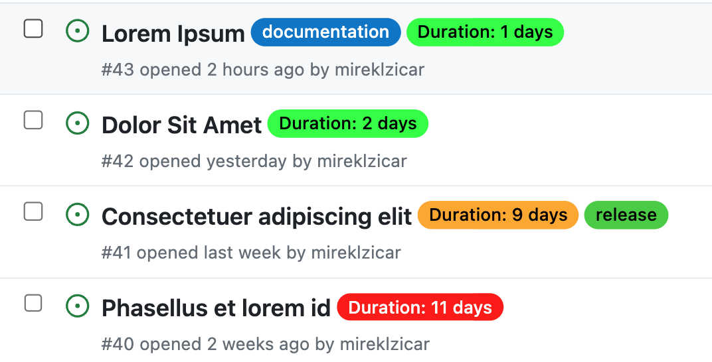

# Issue Duration Labeler

Automatically label issues with their duration and color-code based on configurable thresholds. This GitHub Action helps teams quickly identify how long issues have been open or how long they took to close, improving project management and visibility.



## Input Parameters

| Parameter | Description | Required | Default |
|-----------|-------------|----------|---------|
| `github-token` | GitHub token for authentication | Yes | N/A |
| `short_threshold` | Number of days considered short duration | No | '7' |
| `medium_threshold` | Number of days considered medium duration | No | '30' |
| `short_color` | Color for short duration labels (hex without #) | No | '00FF00' |
| `medium_color` | Color for medium duration labels (hex without #) | No | 'FFA500' |
| `long_color` | Color for long duration labels (hex without #) | No | 'FF0000' |
| `thresholded_update` | Update issue duration only when a threshold is met | No | 'true' |
| `filter_label` | Only process issues with this label (leave empty to process all issues of the specified state) | No | '' |
| `issue_state` | Which issues to process: `all`, `open`, or `closed` | No | 'all' |

## Description

The Issue Duration Labeler action scans issues in your repository (all, open, or closed) and adds color-coded duration labels to each. You can optionally filter to **only process issues with a specific label** (e.g., "ephemeral", "needs-triage", etc.) to focus on particular issues and significantly reduce GitHub API usage.

The duration is calculated as follows:
- **For open issues**: from creation date to current date
- **For closed issues**: from creation date to closed date

Labels are color-coded based on configurable thresholds:
- Short duration (default: 1-7 days): Green
- Medium duration (default: 8-30 days): Orange  
- Long duration (default: >1 month): Red

**API Efficiency Options:**
- **With `filter_label` set**: Processes only issues with the specified label - reduces API calls by up to 90%
- **Without `filter_label`**: Processes all issues of the specified state
- **Issue state control**: Choose `all` (default), `open`, or `closed` issues
- **Pagination support**: Handles repositories with many issues efficiently

When `thresholded_update` is set to true (default), labels are only updated when a threshold is met. This reduces unnecessary label changes for minor duration updates. If set to false, all matching issues will be updated with the current duration every time the action runs.

**Usage Options:**
- **Focused tracking**: Set `filter_label` to target specific issues (e.g., "ephemeral", "needs-review")
- **Complete tracking**: Leave `filter_label` empty to process all issues of the specified state
- **State control**: Process `all` issues (default), only `open` issues, or only `closed` issues

This action can be run on a schedule or triggered manually, allowing you to keep your issues consistently labeled with up-to-date duration information.

## Setup

To use this action in your workflow, add the following YAML to your `.github/workflows/issue-duration-labeler.yml` file:

```yaml
name: Label Issues with Duration

on:
  schedule:
    - cron: '0 0 * * *'  # Run daily at midnight
  workflow_dispatch:  # Allow manual triggering

jobs:
  label-issues:
    runs-on: ubuntu-latest
    steps:
      - uses: mireklzicar/issue-duration@main
        with:
          github-token: ${{ secrets.GITHUB_TOKEN }}
```

## Usage Examples

### Basic usage with default settings

```yaml
- uses: mireklzicar/issue-duration@main
  with:
    github-token: ${{ secrets.GITHUB_TOKEN }}
    issue_state: 'open'
    filter_label: 'ephemeral'  # Only process open issues with "ephemeral" label
```


### Complete tracking with custom settings

```yaml
- uses: mireklzicar/issue-duration@main
  with:
    github-token: ${{ secrets.GITHUB_TOKEN }}
    issue_state: 'open'
    filter_label = 'release'
    short_threshold: '3'
    medium_threshold: '14'
    short_color: '00FF00'
    medium_color: 'FFA500'
    long_color: 'FF0000'
    thresholded_update: 'false'  # Update all issues every run
```

[The rest of the README remains unchanged]
